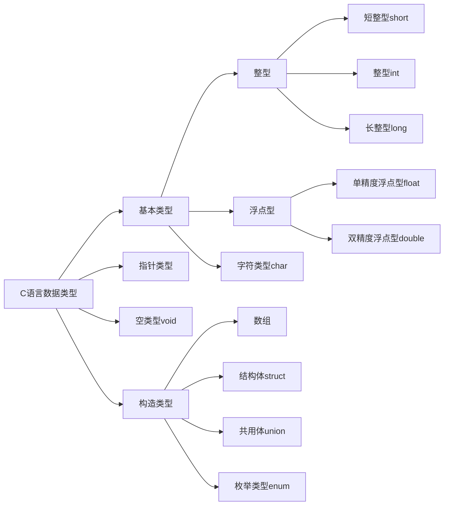

# C程序设计语言总结

[[toc]]

- 注：实验环境MacOS系统。

MacOS系统：

```sh
[mzh@MacBookPro ~ ]$ sw_vers
ProductName:	Mac OS X
ProductVersion:	10.15.5
BuildVersion:	19F101
```

- 学习一门新程序设计语言的唯一途径就是使用它编写程序。
- 总结主要基于《C程序设计语言 第2版新版 徐宝文译》一书。

## 第1章 导言
### 第一个程序hello world

helloworld.c文件内容如下：

```c
#include <stdio.h>

int main()
{
    printf("Hello,world\n");
}
```

编译：

```sh
cc helloworld.c
```

此时默认输出a.out。

通过下面的方式可以指定输出文件的名称：

```sh
cc helloworld.c -o helloworld.out
```

运行：

```sh
$ ./a.out 
Hello,world
$ ./helloworld.out 
Hello,world
```

- 一个C语言程序，无论其大小如何，都是由**函数**和**变量**组成的。
- 每个程序都从`main`函数的起点开始执行，每个程序必须在某个位置包含一个`main`函数。
- 函数之间进行数据交换的一种方法是调用函数向被调用函数提供参数列表。函数名后面的圆括号`()`将参数包裹起来，括号中没有内容时表示没有参数。函数体由`{}`花括号包裹起来。
- `main`函数通常会调用其他函数来帮助完成某些工作，被调用的函数可以是程序设计人员自己编写的，也可以来自于函数库。
- `#include <stdio.h>`用于告诉编译器在本程序中包含标准输入、输出库的信息。
- **printf**函数用于打印输出。**printf**永远不会自动换行。
- 用双引号括起来的字符序列称为**字符串**或**字符常量**。
- **\n**转义字符表示换行。
- **\t**转义字符表示制表符tab。
- **\b**转义字符表示回退符。
- \\"转义字符表示双引号。
- \\\\转义字符表示反斜杠本身。

### 变量与算术表达式

打印华氏温度与摄氏温度对照表，对应关系为 `C=(5/9)(F-32)`。

```c
$ cat fahrenheit2celsius.c
/**
*@file fahrenheit2celsius.c
*@brief 打印华氏温度与摄氏温度对照表
*@author Zhaohui Mei<mzh.whut@gmail.com>
*@date 2019-07-24
*@return 0
*/

#include <stdio.h>

int main()
{
    int fahr, cels;  // 声明变量
    int lower, upper, step;  // 声明变量

    lower = 0;  // 温度的下限
    upper = 300;  // 温度的上限
    step = 20;  // 步长

    fahr = lower;
    while (fahr <= upper)
    {
        cels = 5 * (fahr - 32) / 9;
        printf("%d\t%d\n", fahr, cels);
        fahr = fahr + step;
    }
    return 0;
}
```

生成输出文件`fahrenheit2celsius.out`并运行：

```sh
$ ./fahrenheit2celsius.out 
0	-17
20	-6
40	4
60	15
80	26
100	37
120	48
140	60
160	71
180	82
200	93
220	104
240	115
260	126
280	137
300	148
```

- 注释：包含在`/*`和`*/`之间的字符序列将被编译器忽略。注释可以自由地运用在程序中，使得程序更易于理解。也可以使用`//`来表示单行注释。
- 所有变量必须先声明后使用。声明通常放在函数起始处，在任何可执行语句之前。声明用于说明变量的属性，它由一个类型名和一个变量名组成。
- 赋值语句：类似`lower = 0`这样使用等号对变量进行赋值。

### alias重命名设置

为了快速编译出out文件，设置一下`alias`重命名。在`~/.zshrc`中添加以下内容：

```sh
alias cc='compile_c'
function compile_c()
{
    filename=$1
    outfile=$( echo "$filename"|sed 's/\.c$/\.out/g' )
    clang $filename -o $outfile
}
```

使用`source ~/.zshrc`重新加载配置后，即可以使用`cc helloworld.c`命令自动生成`helloworld.out`文件，不用手动指定输出文件！

### `while`语句

- `while`循环语句中，首先测试圆括号中的条件 ，如果条件为真，则执行循环体，然后再重复测试圆括号中的条件，如果为真，则再次执行循环体；当圆括号中的条件测试为假时，循环结束。
- `printf`函数不是C语言本身的一部分，C语言本身并没有定义输入/输出功能。`printf`是标准库中定义的一个函数。

上面温度转换存在两个问题，输出不是右对齐，不够美观；摄氏温度的精确度不够。我们进行优化：

```c
$ cat fahrenheit2celsius.c
/**
*@file fahrenheit2celsius.c
*@brief 打印华氏温度与摄氏温度对照表
*@author Zhaohui Mei<mzh.whut@gmail.com>
*@date 2019-07-24
*@return 0
*/

#include <stdio.h>

int main()
{
    float fahr, cels;  // 声明变量
    int lower, upper, step;  // 声明变量

    lower = 0;
    upper = 300;
    step = 20;
    
    printf("  F      C\n");
    fahr = lower;
    while (fahr <= upper)
    {
        cels = 5.0 * (fahr - 32.0) / 9.0;
        printf("%3.0f %6.1f\n", fahr, cels);  // 华氏温度取三位字符宽，不带小数点和小数部分，摄氏温度取六位字符宽，且小数点后面取1位小数
        fahr = fahr + step;
    }
    return 0;
}
```

生成输出文件`fahrenheit2celsius.out` 并运行：

```sh
$ ./fahrenheit2celsius.out 
  F      C
  0  -17.8
 20   -6.7
 40    4.4
 60   15.6
 80   26.7
100   37.8
120   48.9
140   60.0
160   71.1
180   82.2
200   93.3
220  104.4
240  115.6
260  126.7
280  137.8
300  148.9
```

- 使用浮点算术运算代替整型算术运算，控制输出精度。
- 如果浮点常量取值是整型值，在书写时最好为它加上一个显示的小数点，这样可以强调其是浮点性质，便于阅读。
- 可以使用`printf`另外单独打印标题。
- 注意，整数除法时会执行舍位，结果中的任何小数部分都会被舍弃。如果在程序中直接使用`5/9`结果得到的将是0，就时结果就是不正确的，使用`5.0/9.0`的形式使用浮点数与浮点数相除的方式不会执行舍位。

```c
$ cat fahrenheit2celsius.c
/**
*@file fahrenheit2celsius.c
*@brief 打印华氏温度与摄氏温度对照表
*@author Zhaohui Mei<mzh.whut@gmail.com>
*@date 2019-07-24
*@return 0
*/

#include <stdio.h>

int main()
{
    float fahr, cels;  // 声明变量
    int lower, upper, step;  // 声明变量

    lower = 0;  // 温度的下限
    upper = 300;  // 温度的上限
    step = 20;  // 步长

    printf("  F      C\n");
    fahr = lower;
    while (fahr <= upper)
    {
        cels = 5 / 9  * (fahr - 32);
        printf("%3.0f %6.1f\n", fahr, cels); // 华氏温度取三位字符宽，不带小数点和小数部分，摄氏温度取六位字符宽，且小数点后面取1位小数
        fahr = fahr + step;
    }
    return 0;
}
```

编译后运行结果如下：

```sh
$ ./fahrenheit2celsius.out
  F      C
  0   -0.0
 20   -0.0
 40    0.0
 60    0.0
 80    0.0
100    0.0
120    0.0
140    0.0
160    0.0
180    0.0
200    0.0
220    0.0
240    0.0
260    0.0
280    0.0
300    0.0
```

可以看到使用`5 / 9`这种方式得到的结果是异常的。

- `printf`中的格式说明`%3.0f`表示待打印的浮点数至少占3个字符宽，且不带小数点和小数部分。
- `%6.1f`表示待打印的浮点数至少占6个字符宽，且小数点后面有1位数字。
- 格式说明可以省略宽度与精度。
- `%6f`表示待打印的浮点数至少有6个字符宽。
- `%.2f`表示待打印的浮点数的小数点后有两位小数，但宽度没有限制。
- `%f`仅仅要示按照浮点数打印即可。
- `%d`表示按照十进制整型数打印。
- `%6d`表示按十进制整型数打印，但至少占6个字符宽。
- `%o`表示按八进制数打印。
- `%x`表示按十六进制数打印。
- `%c`表示字符。
- `%s`表示字符串。
- `%%`表示百分号本身。

### `for`语句

使用`for`循环实现上面的功能：

```c
$ cat fahrenheit2celsius_for.c
/**
*@file fahrenheit2celsius_for.c
*@brief 打印华氏温度与摄氏温度对照表
*@author Zhaohui Mei<mzh.whut@gmail.com>
*@date 2019-07-24
*@return 0
*/

#include <stdio.h>

int main()
{
    float cels;  // 声明变量

    printf("  F      C\n");
    for(int fahr = 0;fahr <= 300;fahr = fahr + 20)
    {
        cels = 5.0 * (fahr - 32.0) / 9.0;
        printf("%3d %6.1f\n", fahr, cels);  // 华氏温度取三位字符宽，不带小数点和小数部分，摄氏温度取六位字符宽，且小数点后面取1位小数
    }
    return 0;
}
```

生成输出文件`fahrenheit2celsius_for.out` 并运行：

```sh
$ ./fahrenheit2celsius_for.out 
  F      C
  0  -17.8
 20   -6.7
 40    4.4
 60   15.6
 80   26.7
100   37.8
120   48.9
140   60.0
160   71.1
180   82.2
200   93.3
220  104.4
240  115.6
260  126.7
280  137.8
300  148.9
```

- 上面使用`for`的结果与使用`while`语句的结果相同。
- `for`循环语句适合于初始化和增加步长都是条件语句并且逻辑相关的情形，比`while`语句更加紧凑。

以逆序打印转换表：

```c
$ cat fahrenheit2celsius_for.c
/**
*@file fahrenheit2celsius_for.c
*@brief 打印华氏温度与摄氏温度对照表
*@author Zhaohui Mei<mzh.whut@gmail.com>
*@date 2019-07-24
*@return 0
*/

#include <stdio.h>

int main()
{
    float cels;  // 声明变量

    printf("  F      C\n");
    for(int fahr = 300;fahr >= 0;fahr = fahr - 20)
    {
        cels = 5.0 * (fahr - 32.0) / 9.0;
        printf("%3d %6.1f\n", fahr, cels);  // 华氏温度取三位字符宽，不带小数点和小数部分，摄氏温度取六位字符宽，且小数点后面取1位小数
    }
    return 0;
}
```

输出如下：

```sh
$ ./fahrenheit2celsius_for.out 
  F      C
300  148.9
280  137.8
260  126.7
240  115.6
220  104.4
200   93.3
180   82.2
160   71.1
140   60.0
120   48.9
100   37.8
 80   26.7
 60   15.6
 40    4.4
 20   -6.7
  0  -17.8
```

### `#define`定义符号常量

- 幻数：把直接使用的常数叫做幻数。应尽量避免使用幻数。因为当常量需要改变时，要修改所有使用它的代码。

- 在程序中使用300或20等类似的`幻数`不是一个好习惯。它们几乎无法向以后阅读该程序的人提供什么信息，而且使程序的修改变得更加困难。处理幻数的一种方法就是赋予它们有意义的名字。
- `#define`指令可以把符号名(或称为符号常量)定义为一个特定的字符串，语法格式如下：

```
#define 名字 替换文本
```

- 程序中所有出现在在`#define`中定义的符号常量的名字都将被相应的替换文本替换。

下面对温度转换表程序进行优化，使用符号常量：

```c
$ cat fahrenheit2celsius_for_define.c 
/**
*@file fahrenheit2celsius_for_define.c
*@brief 打印华氏温度与摄氏温度对照表
*@author Zhaohui Mei<mzh.whut@gmail.com>
*@date 2019-07-24
*@return 0
*/

#include <stdio.h>

#define LOWER 0  // 温度表的下限
#define UPPER 300  // 温度表的上限
#define STEP 20  // 步长
int main()
{
    float cels;  // 声明变量

    printf("  F      C\n");
    for(int fahr = LOWER;fahr <= UPPER;fahr = fahr + STEP)
    {
        cels = 5.0 * (fahr - 32.0) / 9.0;
        printf("%3d %6.1f\n", fahr, cels);  // 华氏温度取三位字符宽，不带小数点和小数部分，摄氏温度取六位字符宽，且小数点后面取1位小数
    }
    return 0;
}
```

生成输出文件`fahrenheit2celsius_for_define.out` 并运行：

```sh
$ cc fahrenheit2celsius_for_define.c -o fahrenheit2celsius_for_define.out
$ ./fahrenheit2celsius_for_define.out 
  F      C
  0  -17.8
 20   -6.7
 40    4.4
 60   15.6
 80   26.7
100   37.8
120   48.9
140   60.0
160   71.1
180   82.2
200   93.3
220  104.4
240  115.6
260  126.7
280  137.8
300  148.9
```

示例中定义了`LOWER`,`UPPER`,`STEP`三个符号常量。

- 符号常量不是变量，不需要出现在声明中。
- 符号常量通常使用大写字母拼写，这样很容易与小写字母拼写的变量名相区别。
- `#define`指令定义符号常量的行的末尾**不需要分号结尾**！

### `getchar()`,`putchar()`字符输入与输出

- 无论文本从可处输入，输出到何处，其输入，输出都是按照字符流的方式处理。
- 文本流是由多行字符构成的字符序列，而每行字符则是由0个或多个字符组成，行末是一个换行符。
- 标准库负责使每个输入/输出流都 能够遵守这一模型。
- 标准库提供了一次读/写一个字符的函数，其中最简单的是`getchar()`,`putchar()`两个函数。
- `getchar()`每次从文本流中读入下一个输入字符（这个字符通常是通过键盘输入的），并将其作为结果值返回。
- `putchar(c)`将打印变量c的内容，通常是显示在屏幕上。

在不了解其他输入/输出知识的情况下，可以使用`getchar()`,`putchar()`函数编写出数量惊人的有用代码。

#### 将输入流原样显示在输出流

每读入一个字符后，就把这个字符原样显示在输出流中，如下示例：

```c
$ cat getcharputchar.c
/**
*@file getcharputchar.c
*@brief 将输入字符复制到输出 
*@author Zhaohui Mei<mzh.whut@gmail.com>
*@date 2019-07-24
*@return 0
*/

#include <stdio.h>

int main()
{
    int c;

    c = getchar();
    while (c != EOF)
    {
        putchar(c);
        c = getchar();
    }
    return 0;
}
```

编译并运行：

```sh
$ cc getcharputchar.c -o getcharputchar.out
$ ./getcharputchar.out 
a
a
b
b
c
c
```

运行时，我输入字母a，马上就输出字母a，我再输出字母b，马上就输出字母b，我再输出字母c，马上就输出字母c，我按Ctrl-D终止，此时程序就自动退出了。

- Linux中，在新的一行的开头，按下Ctrl-D，就代表EOF（如果在一行的中间按下Ctrl-D，则表示输出"标准输入"的缓存区，所以这时必须按两次Ctrl-D）。参考[EOF是什么？](http://www.ruanyifeng.com/blog/2011/11/eof.html "EOF是什么？")。
- Windows中，在新的一行的开头，按下Ctrl-Z就代表EOF。
- Mac中，按control + D键结束。
- 字符在键盘，屏幕或其他任何地方无论以什么形式表现，它在机器内部都是以位模式存储的。`char`类型专门用于存储这种字符型数据，当然任何整型(`int`)也可以用于存储字符型数据，出于某些潜在的重要原因，在此使用`int`类型。
- `EOF`表示文件结束，End of file。定义在头文件`stdio.h`中 ，定义如下` #define EOF (-1)`。
- 可以将赋值语句(如`c = getchar()`)作为更大的表达式的一部分出现，就可以形成复杂语句(如下面的` while ((c = getchar()) != EOF)`)。


使用赋值语句形成复杂语句实现同样的功能：

```c
$ cat getcharnotequaleof.c
/**
*@file getcharnotequaleof.c
*@brief 使用赋值语句  
*@author Zhaohui Mei<mzh.whut@gmail.com>
*@date 2019-08-01
*@return 0
*/

#include <stdio.h>

int main()
{
    int c;
    while ((c = getchar()) != EOF)
    {
        putchar(c);
    }
    return 0;
}
```

虽然使用上面的复杂语句使得`getchar()`只在程序中出现了次，使程序看起来更加紧凑，使程序更易阅读。但不宜过多地使用这种类型的复杂语句，这样会导致编写的程序可能很难理解。

注意上面的复杂语句中，`c = getchar()`外侧的左右括号不能省略，如果省略后将使程序语意发生变化，因为`!=`优先级高于`=`，这样会导致先会将获取到的字符与`EOF`比较，将比较的结果返回给c。

#### 打印EOF的值

练习1-7 编写一个打印EOF值和程序。

```sh
$ cat print_EOF.c
/*
 *      Filename: print_EOF.c
 *        Author: Zhaohui Mei<mzh.whut@gmail.com>
 *   Description: 打印EOF的值
 *   Create Time: 2021-01-06 21:49:41
 * Last Modified: 2021-01-06 22:15:43
 */

#include<stdio.h>

int main()
{
    printf("%d\n", EOF);
    return 0;
}
```

编译并运行：

```sh
 cc print_EOF.c
 $ ./print_EOF.out
-1
```

可以看到`EOF`的值是`-1`。


#### 字符统计

下面统计输入了多少个字符：

```c
$ cat countchar.c
/**
*@file countchar.c
*@brief 统计字符数 
*@author Zhaohui Mei<mzh.whut@gmail.com>
*@date 2019-08-01
*@return nc
*/

#include <stdio.h>

int main()
{
    long nc = 0;
    while (getchar() != EOF)
    {
        ++nc;
    }
    printf("%ld\n", nc);
    return nc;
}

```

编译并运行：

```sh
$ cc countchar.c -o countchar.out 
$ ./countchar.out 
a
b
c
d
8
```

由于输入字符a/b/c/d后都按了一次Enter回车键，所以每行相当于输入了两个字符，一共输入了8个字符。

注，在Mac上面运行稍有不同：

```sh
$ ./countchar.out
1
2D
$ ./countchar.out
12
3D
$ ./countchar.out
1234567
8D
$ ./countchar.out
123456
78
10
$ ./countchar.out
123456789012
13
```

可以看到当字符数小于10时，数字后多了一个`D`字符。

我们可以使用双精度浮点数`double`处理更大的数字。使用`for`循环语句来处理统计字符：

```sh
$ cat countchar_2.c
/*
 *      Filename: countchar_2.c
 *        Author: Zhaohui Mei<mzh.whut@gmail.com>
 *   Description: 统计输入的字符数版本2
 *   Create Time: 2021-01-06 22:37:04
 * Last Modified: 2021-01-07 07:32:10
 */

#include<stdio.h>

int main()
{
    double nc; // 双精度浮点数
    for (nc = 0; getchar() != EOF; ++nc)
        ;
    printf("%.0f\n", nc);
}
```

编译后运行：

```sh
$ cc countchar_2.c
$ ./countchar_2.out
abcd
5D
$ ./countchar_2.out
1
2
3
4
8D
$ ./countchar_2.out
12345
67890
12
$ ./countchar_2.out
0D
```

注意，在该程序中，`for`循环语句的循环体是空的，这是因为所有工作都在测试(条件)部分与增加步长部分完成了。当用户未输入任何值时，直接按退出，此时输出结果为0。

- C语言语法规则要求`for`循环语句必须有一个循环体，因此用单独的分号代替。
- 单独的分号称为空语句。

#### 行统计

下面统计输入的行数：

```c
$ cat countline.c
/**
*@file countline.c
*@brief 统计行数 
*@author Zhaohui Mei<mzh.whut@gmail.com>
*@date 2019-08-01
*@return nl
*/

#include <stdio.h>

int main()
{
    int c = 0;
    int nl = 0;
    while ((c = getchar() ) != EOF)
    {
        if (c == '\n')
        {
            ++nl;
        }
    }
    printf("lines: %d\n", nl);
    return nl;
}
```

编译并执行：

```sh
$ cc countline.c -o countline.out
$ ./countline.out 
ab
cd
ef
gh
lines: 4
```

一共输入了四行，最后按Ctrl+D时就会打印行数：lines:  4 。

#### 将连续的多个空格用一个空格代替

练习1-9：编写一个将输入复制到输出的程序，并将其中连续的多个空格用一个空格代替。

```c
$ cat replacemultispace2onespace.c
/**
*@file replacemultispace2onespace.c
*@brief 将输入复制到输出，并将连接多个空格用一个空格代替 
*@author Zhaohui Mei<mzh.whut@gmail.com>
*@date 2019-08-01
*@return 0 
*/

#include <stdio.h>

int main()
{
    int c;
    c = getchar(); // 读取字符
    while (c != EOF)  // 不是文件结尾符时
    {
        if (c == ' ')  // 如果读取到的字符是空格
        {
            putchar(c); // 先将空格打印出来
            // 然后循环读取后面的字符，如果字符是空格，不打印
            // 如果不是空格，则跳出内层while语句
            while((c=getchar()) == ' ' && c != EOF)
            {
                ;
            }
        }
        putchar(c); // 打印内层while中检查到的非空格字符
        c = getchar(); // 再读取下一个字符
    }
    return 0;
}
```

编译并运行：

```sh
$ cc replacemultispace2onespace.c -o replacemultispace2onespace.out
$ ./replacemultispace2onespace.out 
aa bb   cc   ddd   eeee      fff    ggg
aa bb cc ddd eeee fff ggg
```

#### 将制表符用"\t"代替显示

练习1-10：编写一个将输入复制到输出的程序，并将其中的制表符替换为\t，将反斜杠替换为\\\。

```c
$ cat replacechars.c
/**
*@file replacechars.c
*@brief 输入复制到输出，并替换多个字符 
*@author Zhaohui Mei<mzh.whut@gmail.com>
*@date 2019-08-01
*@return 0
*/

#include <stdio.h>

int main()
{
    int c;
    while((c = getchar()) != EOF)
    {
        if (c == '\t')
            printf("\\t");
        if (c == '\b')
            printf("\\b");
        if (c == '\\')
            printf("\\\\");
        if ((c != '\t') && (c != '\b') && (c != '\\'))
            putchar(c);
    }
    return 0;
}
```

编译并运行：

```sh
$ ./replacechars.out 
a	b       c
a\tb\tc
a\b\c
a\\b\\c
```

#### 统计文件的行数、单词数、字符数

下面的程序用于统计统计行数、单词数和字符数，此处对单词的定义比较宽松，它是任何其中不包含空格、换行符和制表符的字符序列。下面的程序功能类似于linux上的命令 `wc` 。

```c
$ cat count_words.c
/**
*@file count_words.c
*@brief 统计输入的行数、单词数与字符数
*@author Zhaohui Mei<mzh.whut@gmail.com>
*@date 2019-10-20
*@return 0
*/

#include <stdio.h>

#define IN 1  /* 定义符号常量，在单词中 */
#define OUT 0  /* 定义符号常量，不在单词中 */

int main()
{
    int c, nl, nw, nc, state;  /* 字符、行数、单词数、字符数、状态信息 */
    
    state = OUT;  /* 初始状态不在单词中 */
    nl = nw = nc = 0;  /* 行数、单词数、字符数初始值为0 */
    
    /* 不停地读取字符数据，如果不是结尾符 */
    while((c = getchar()) != EOF )
    {
        ++nc;  /* 字符数增1 */
        if (c == '\n')
        {
            ++nl; /* 行数增1 */
        }
        /* 如果字符是空格或是换行符或是制表符*/
        if (c == ' ' || c == '\n' || c == '\t')
        {
            state = OUT;
        }
        else // 是普通字符时
        {
            // 只有当状态不是是单词时，才需要追加一次
            // 如果已经是单词状态则不用重复计数
            if (state == OUT)
            {
                state = IN;
                ++nw;  /* 单词数增1 */
            }
        }
    }
    printf("%d %d %d\n", nl, nw, nc);
    return 0;
}
```


编译并运行：

```sh
$ cc count_words.c -o count_words.out
$ ./count_words.out < count_words.c
47 131 1281
```

#### 每行一个单词的形式打印输出

练习1-12，编写一个程序，以每行一个单词的形式打印其输入。

```c
$ cat print_words.c
/*
 *      Filename: print_words.c
 *        Author: Zhaohui Mei<mzh.whut@gmail.com>
 *   Description: 每行打印一个单词
 *   Create Time: 2021-01-17 21:44:40
 * Last Modified: 2021-01-17 23:01:09
 */

#include <stdio.h>

#define IN 1
#define OUT 0

int main()
{
    int c, state;
    while ((c=getchar()) != EOF)
    {
        if (c == ' ' || c == '\t' || c == '\n')
        {
            if (state == IN){
                printf("\n");
            }
            state = OUT;
        }
        else
        {
            state = IN;
            printf("%c", c);
        }
    }
}
```

编译并运行：

```sh
$ cc print_words.c
$ ./print_words.out
the first line!
the
first
line!
the second line!
the
second
line!
```

### 数组的使用

编写一个程序，来统计各个数字、空白符（包括空格符、制表符及换行符）以及所有其他字符出现的次数。

所有的输入字符可以分为12类。可以使用一个数组存放各个数字出现的次数。这样比独立使用10个变量更方便。

下面是该程序的一个版本。

```c
$ cat number_white_other.c
/*
 *      Filename: number_white_other.c
 *        Author: Zhaohui Mei<mzh.whut@gmail.com>
 *   Description: 统计数字、空白符以及其他字符的个数
 *   Create Time: 2021-01-18 20:41:19
 * Last Modified: 2021-01-18 20:49:03
 */

#include <stdio.h>

int main()
{
    int c, i, nwhite, nother;
    int ndigit[10];

    nwhite = nother = 0;
    for (i = 0; i < 10; ++i)
        ndigit[i] = 0;

    while ((c=getchar()) != EOF)
        if (c >= '0' && c <= '9')
            ++ndigit[c-'0'];
        else if (c == ' ' || c == '\n' || c == '\t')
            ++nwhite;
        else
            ++nother;

    printf("digits =");

    for (i = 0; i < 10; ++i)
        printf(" %d", ndigit[i]);
    printf(", white space = %d, other = %d\n", nwhite, nother);

    return 0;
}

$
```

编译并运行：

```sh
$ cc number_white_other.c
$ ./number_white_other.out
ab 1 2 3 4 5 66 77 888 9999 0000 cdefg
digits = 4 1 1 1 1 1 2 2 3 4, white space = 12, other = 7
$
```

#### 绘制输入中单词长度的直方图

练习1-13，待补。

#### 绘制输入中各个字符出现频度的直方图

练习1-14，待补。


### 函数

- 函数为计算的封装提供了一种简便的方法。
- 使用设计正确的函数，程序员无须考虑功能是如何实现的。只需要知道它具有哪些功能就可以。
- `printf`、`getchar`、`putchar`等函数都是函数库中提供的函数。
- 函数定义可以任意次序出现在一个源文件或多个源文件中，但同一个函数不能分割在多个文件中。
- 函数定义中圆括号内列表中出现的变量称为`形式参数`，把函数调用中与形式参数对应的值称为`实际参数`。
- 函数不一定都有返回值。不带表达式的`return`语句将把控制权返回给调用者，但不返回有用的值。
- 返回值为0表示正常终止，返回值为非0表示出现异常情况或出错结束条件。
- `main`函数的`return`语句是向期调用者返回一个值，也就是向程序的执行环境返回状态。
- 函数原型与函数声明中参数名不要求相同。事实上，函数原型中的参数名是可选的，但是，合适的参数名能够起到很好的说明性作用，因此在函数原型中总是指明参数。

编写一个计算整数m的n次幂函数。下面的示例中，是将`power`函数和`main`函数存放在一个文件中。

```c
$ cat power.c
/*
 *      Filename: power.c
 *        Author: Zhaohui Mei<mzh.whut@gmail.com>
 *   Description: 计算m的n次幂
 *   Create Time: 2021-01-19 21:07:19
 * Last Modified: 2021-01-19 21:11:17
 */

#include <stdio.h>

int power(int m, int n);  // 函数原型

int power(int base, int n)  // 函数声明
{
    int i, p;
    p = 1;
    for (i=1;i<=n;i++)
    {
        p = p * base;
    }
    return p;
}

int main()  // 主函数
{
    printf("power(2, 3) = %d\n", power(2, 3));
    printf("power(-2, 3) = %d\n", power(-2, 3));
    return 0;
}

```

编译并运行：

```sh
$ cc power.c
$ ./power.out
power(2, 3) = 8
power(-2, 3) = -8
```

第12行的`int power(int m, int n)`是函数声明，声明参数的类型、名字以及该函数返回结果的类型。

`power`函数所使用参数名字只对`power`函数内部有效，对其他任何函数都是不可见的。其他函数可以使用与之相同的参数名字而不会引起冲突。`power`函数计算所得的结果通过`return`语句返回给`main`函数。

### 参数-传值调用

- C语言中所有函数参数都是通过值传递的。也就是说，传递给被调用函数的参数值存放在临时变量中，而不是存放在原来的变量中。
- C语言中，被调用函数不能直接修改主调用函数中变量的值，而只能修改其私有的临时副本的值。

下面我们改写`power`函数，通过将参数`n`作为临时变量，`power`函数内部对n的任何操作不会影响到调用函数中n的原始参数值。

```c
$ cat power1.c
/*
 *      Filename: power1.c
 *        Author: Zhaohui Mei<mzh.whut@gmail.com>
 *   Description: 计算m的n次幂
 *   Create Time: 2021-01-19 21:07:19
 * Last Modified: 2021-01-24 15:56:30
 */

#include <stdio.h>

int power(int m, int n);

int power(int base, int n)
{
    int p;
    for (p = 1; n > 0; --n)
    {
        p = p * base;
    }
    return p;
}

int main()
{
    printf("power(2, 3) = %d\n", power(2, 3));
    printf("power(-2, 3) = %d\n", power(-2, 3));
    return 0;
}

```

编译并运行：

```sh
$ cc power1.c
$ ./power1.out
power(2, 3) = 8
power(-2, 3) = -8
```

可以看到运行的结果与之间的程序运行的结果是一样的。

### 字符数组

- 字符数组是C语言中最常用的数组类型。
- 每一行至少包含一个字符，只包含换行符的行，其长度为1。
- 函数的默认返回值类型是`int`。
- 字符串应以`\0`结尾标识字符串结束。`printf`函数中格式规范`%s`规定，对应的参数必须是以`\0`结尾的字符串。

### 外部变量与作用域

- 函数中的每个局部变量只在函数被调用时存在，在函数执行完毕退出时消失。
- 局部变量也称为自动变量。
- 在函数的两次调用之间，自动变量不保留前次调用时的赋值，且在每次进入函数时都要显示地为其赋值。
- 位于所有函数外部的变量称为外部变量，外部变量可以在全局访问。外部变量在程序执行期间一直存在。即使在对外部变量赋值的函数返回后，这些变量仍然保持原来的值不变。
- 外部变量必须定义在所有函数之外，且只能定义一次，定义后编译程序将为它分配存储单元。
- 如果要声明空参数表，则必须使用关键字`void`进行显示声明。
- 在C语言中，注释不允许嵌套。


## 第2章 类型、运算符与表达式

- 变量和常量是程序处理的两种基本数据对象。
- 声明语句说明变量的名字及类型，也可以指定变量的初值。
- 运算符指定将要进行的操作。
- 表达式则把变量与常量组合起来生成新的值。
- 对象的类型决定该对象可取值的集合以及可以对该对象执行的操作。
- 所有整型都包含`signed(带符号)`和`unsigned(无符号)`两种形式。
- 对象可以声明为`const(常量)`类型，表明其值不能修改。

### 变量名的限定

- 对变量的命名与符号常量的命名存在一些限定条件。
- 名字是由字母(a-zA-Z)和数字(0-9)组成的序列，下划线(_)被看作字母，名字开头不能是下划线。
- 由于库例程的名字通常以下划线开头，因此变量名不要以下划线开头。
- 使用下划线可以提高变量名的可读性。
- 不要使用C语言关键字(类似`if`、`else`、`int`、`float`等等)作为变量名。
- 名字大小写敏感的。
- 变量名使用使用小写字母(lower_case_with_underline)，符号常量名全部使用大写字母(UPPER_CASE_WITH_UNDERLINE)。
- 名称要能够尽可能从字面上表达变量的用途。
- 局部变量一般使用较短的变量名，外部变量使用较长的名字。
- 变量在使用前，需要先声明，并初始化。未初始化的变量在使用时，如果变量i未初始化，会提示`Variable 'i' is uninitialized when used here`异常。

### 数据类型及长度

使用下面的图形表示C语言数据类型(注：MarkDown图形的绘制参考https://blog.csdn.net/whatday/article/details/88655461)：




- 此处仅说明基本类型， `short`、`int`、`long`、`float`、`double`、`char`这六个关键字代表C语言里面的六种基本数据类型。

- `int`通常代表特定机器中整数的自然长度。默认是带符号`signed`的。

- 字符类型`char`占用1个字节，可以存放本地字符集中的一个字符。

- 类型限定符`signed`和`unsigned`可以用于限定`char`类型或任何整型。

- `unsigned`无符号类型的数总是正数或0。不应将负数赋值给一个无符号类型的变量或常量。

- 在符号数和无符号数逻辑运算时，默认会将有符号数看成无符号数进行运算！返回无符号数（`unsigned`）的结果。

- 各种类型的存储大小与系统位数有关，但目前通用的以64位系统为主。

- 可以使用`sizeof`获取类型的长度，表达式`sizeof(type)`得到对象或类型的存储字节大小。

  

使用下面的代码获取`short`、`int`、`long`、`float`、`double`、`char`基本数据类型在Linux和Windows 10系统中的长度：

```c
$ cat base_data_type.c                                         
/**                                                            
*@file base_data_type.c                                        
*@brief 基本数据类型                                           
*@author Zhaohui Mei<mzh.whut@gmail.com>                       
*@date 2019-10-20                                              
*@return 0                                                     
*/                                                             
                                                               
#include <stdio.h>                                             
#include <limits.h>                                            
                                                               
int main()                                                     
{                                                              
    printf("char占用的内存大小是%d\n", sizeof(char));          
    printf("short占用的内存大小是%d\n", sizeof(short));        
    printf("int占用的内存大小是%d\n", sizeof(int));            
    printf("long占用的内存大小是%d\n", sizeof(long));          
    printf("float占用的内存大小是%d\n", sizeof(float));        
    printf("double占用的内存大小是%d\n", sizeof(double));      
    return 0;                                                  
}                                                              
```

在Linux系统上面编译运行：

```sh
$ cc base_data_type.c -o base_data_type.out
$ ./base_data_type.out
char占用的内存大小是1
short占用的内存大小是2
int占用的内存大小是4
long占用的内存大小是8
float占用的内存大小是4
double占用的内存大小是8
```

在Windows 10系统上面编译运行：

```sh
$ chcp 65001                                          
Active code page: 65001                               
                                                      
$ cc base_data_type.c -o base_data_type.out           
                                                      
$ base_data_type.out                                  
char占用的内存大小是1                                 
short占用的内存大小是2                                
int占用的内存大小是4                                  
long占用的内存大小是4                                 
float占用的内存大小是4                                
double占用的内存大小是8                               
```

可以看到`long`长整型在Linux系统和Windows系统上面存在差异。

在MacOS上编译运行时异常，提示`warning: format specifies type 'int' but the argument has type 'unsigned long' [-Wformat]`,将代码中的`%d`标识符替换成`%lu`，后运行。

```c
$ cat base_data_type.c
/**
*@file base_data_type.c
*@brief 基本数据类型
*@author Zhaohui Mei<mzh.whut@gmail.com>
*@date 2019-10-20
*@return 0
*/

#include <stdio.h>
#include <limits.h>

int main()
{
    printf("char占用的内存大小是%lu\n", sizeof(char));
    printf("short占用的内存大小是%lu\n", sizeof(short));
    printf("int占用的内存大小是%lu\n", sizeof(int));
    printf("long占用的内存大小是%lu\n", sizeof(long));
    printf("float占用的内存大小是%lu\n", sizeof(float));
    printf("double占用的内存大小是%lu\n", sizeof(double));
    return 0;
}
$ cc base_data_type.c
$ ./base_data_type.out
char占用的内存大小是1
short占用的内存大小是2
int占用的内存大小是4
long占用的内存大小是8
float占用的内存大小是4
double占用的内存大小是8
```

我们先来通过打印`<limits.h>`头文件中定义的最小最大值看一下`char`、`short`、`int`、`long`类型的最小最大值。

```c
$ cat min_max_value.c
/*
 *      Filename: min_max_value.c
 *        Author: Zhaohui Mei<mzh.whut@gmail.com>
 *   Description: 带符号和不带符号位最大最小值
 *   Create Time: 2021-02-21 18:44:26
 * Last Modified: 2021-02-21 19:25:41
 */

#include <stdio.h>
#include <limits.h>

int main(void)
{
    printf("有符号最小最大值:\n");
    printf("CHAR_MIN = %d\n", CHAR_MIN);
    printf("CHAR_MAX = %d\n", CHAR_MAX);
    printf("SHRT_MIN = %d\n", SHRT_MIN);
    printf("SHRT_MAX = %d\n", SHRT_MAX);
    printf("INT_MIN = %d\n", INT_MIN);
    printf("INT_MAX = %d\n", INT_MAX);
    printf("LONG_MIN = %ld\n", LONG_MIN);
    printf("LONG_MAX = %ld\n", LONG_MAX);

    printf("无符号最小最大值:\n");
    printf("UCHAR_MAX = %u\n", UCHAR_MAX);
    printf("USHRT_MAX = %u\n", USHRT_MAX);
    printf("UINT_MAX = %u\n", UINT_MAX);
    printf("ULONG_MAX = %lu\n", ULONG_MAX);

    return 0;
}
```

编译并运行:

```sh
$ cc min_max_value.c
$ ./min_max_value.out
有符号最小最大值:
CHAR_MIN = -128
CHAR_MAX = 127
SHRT_MIN = -32768
SHRT_MAX = 32767
INT_MIN = -2147483648
INT_MAX = 2147483647
LONG_MIN = -9223372036854775808
LONG_MAX = 9223372036854775807
无符号最小最大值:
UCHAR_MAX = 255
USHRT_MAX = 65535
UINT_MAX = 4294967295
ULONG_MAX = 18446744073709551615
```


我们测试一下`int`类型默认是无符号还是有符号的。

```c
$ cat test_default_signed.c
/*
 *      Filename: test_default_signed.c
 *        Author: Zhaohui Mei<mzh.whut@gmail.com>
 *   Description: 测试默认是无符号还是有符号
 *   Create Time: 2021-02-20 06:45:35
 * Last Modified: 2021-02-21 19:18:20
 */

#include <stdio.h>

int main(void)
{
    unsigned int a = -1;
    int b = -1;
    printf("unsigned int a = %d\n", a);
    printf("unsigned int with %%d sign a = %d\n", a);
    printf("unsigned int with %%u sign a = %u\n", a);
    printf("default int b = %d\n", b);
    printf("default int with %%d sign b = %d\n", b);
    printf("default int with %%u sign b = %u\n", b);
    printf("a + b = %d\n", a+b);
    printf("a - b = %d\n", a-b);
    printf("a * b = %d\n", a*b);
    printf("a / b = %d\n", a/b);

    if (a > b)
        printf("a > b\n");
    else
        printf("a < b\n");

    return 0;
}
```

编译并运行：

```sh
$ cc test_default_signed.c
$ ./test_default_signed.out
unsigned int a = -1
unsigned int with %d sign a = -1
unsigned int with %u sign a = 4294967295
default int b = -1
default int with %d sign b = -1
default int with %u sign b = 4294967295
a + b = -2
a - b = 0
a * b = 1
a / b = 1
a < b
$
```

可以看到将负数`-1`赋值给无符号整数`a`，如果按无符号数输出的话，输出值是`4294967295`，是一个特别大的数据，为`2^32 - 1`，2的32次方后再减去1。这与我们预期的不一样，其实不应该将负数赋值给无符号整数类型的。`printf`在处理过程中，会先将传给函数的值进行转换。

通过`int b = -1;`的定义并输出，可以看到以`%d`标识 以十进制形式输出带符号整数 输出的结果为`-1`，与我们期望的一样，而以`%u`  以十进制形式输出无符号整数 输出的结果是`4294967295`，与实际值不符。

因此我们可以看到`int`默认情况下是带符号`signed`的。

而最后`a < b`的原因是：

无符号整数`a = -1`，此时会将`-1`对应的原码看作是正数，其对应的原码为`1000 0000  0000 0000  0000 0000  0000 0001`,正数时，对应的补码和原码相同。`int b = -1`是有符号整型，需要转换成补码然后计算，补码就是`1111 1111  1111 1111  1111 1111  1111 1111`，这时对这两个补码比较，就可以看到`a < b`。


###   常量

- 类似于1 2 3 4 的整数常量属于`int`类型。
- `long`长整型类型的常量以字母l或L结尾。
- 没有后缀的浮点数为`double`类型，后缀f或F表示为`float`类型，后缀l或L表示为`long double`类型。
- 无符号常量以字母u或U结尾，后缀ul或UL表明是`unsigned long`类型。
- 前缀为0的整型常量表示它是八进制形式。十进制31可以写成八进制形式037。
- 前缀为0x或0X的整型常量表示它是十六进制形式。十进制31可以写成十六进制形式0x1f或0X1F。
- 使用后缀`L`表示`long`类型，使用后缀`U`表示`unsigned`无符号类型，如`0XFUL`是一个`unsigned long`类型（无符号长整型）的常量，其值等于十进制数15。
- 一个字符常量是一个整数，书写时将一个字符括在单引号中，如`'x'`。字符在机器字符集中的数值就是字符常量的值。
- 某些字符可以通过转义字符序列(例如：换行符`\n`)表示为字符和字符串常量。
- 转义字符序列看起来像两个字符，但只表示一个字符。
- 可以使用'\ooo'表示任意的字节大小的位模式，其中ooo代表1~3个八进制数字(0~7)。
- 也可以使用'\xhh'表示任意的字节大小的位模式，其中hh代表1个或多个十六进制数字(0~9,a~f,A~F)。

下表是ANSI C语言中的全部转义字符序列：

| 转义字符 | ASCII码值(十进制) |                 意义                 |
| -------- | :---------------- | :----------------------------------: |
| \\a      | 007               |             响铃符(BEL)              |
| \\b      | 008               |   退格符(BS)，将当前位置移到前一列   |
| \\f      | 012               |  换页符(FF)，将当前位置移到下页开头  |
| \\n      | 010               | 换行符(LF)，将当前位置移到下一行开头 |
| \\r      | 013               | 回车符(CR) ，将当前位置移到本行开头  |
| \\t      | 009               |            水平制表符(HT)            |
| \\v      | 011               |            垂直制表符(VT)            |
| \\\\     | 092               |                反斜杠                |
| \\\'     | 039               |                单引号                |
| \\\"     | 034               |                双引号                |
| \ooo     | -                 |                八进制                |
| \xhh     | -                 |               十六进制               |

- 字符常量'\0'表示值为0的字符，也就是空字符(null)。
- 通常用'\0'的形式代替0，以强调某些表达式的字符属性，但其数字值为0。
- 常量表达式是仅仅包含常量的表达式。
- 常量表达式在编译时求值，而不是在运行时求值。它可以出现在常量可以出现的任何位置。

常量表达式示例：

```c
#define MAXLINE 1000
#define LEAP 1 // 闰年
char line[MAXLINE+1];
int days[31+28+LEAP+31+30+31+30+31+31+30+31+30+31];
```

测试常量的转化输出。

```c
$ cat test_constant.c
/*
 *      Filename: test_constant.c
 *        Author: Zhaohui Mei<mzh.whut@gmail.com>
 *   Description: 测试常量的使用
 *   Create Time: 2021-02-22 06:39:47
 * Last Modified: 2021-02-22 06:50:21
 */

#include <stdio.h>

#define NUM 31

int main(void)
{
    printf("NUM = %d\n", NUM);
    printf("进行转换，无前缀输出:\n");
    // 8进制输出
    printf("Output with Octal number system. NUM = %o\n", NUM);
    // 16进制输出
    printf("Output with Hexadecimal number system. NUM = %x\n", NUM);
    printf("Output with Hexadecimal number system. NUM = %X\n", NUM);

    printf("进行转换，有前缀输出:\n");
    // 8进制输出
    printf("Output with Octal number system. NUM = %#o\n", NUM);
    // 16进制输出
    printf("Output with Hexadecimal number system. NUM = %#x\n", NUM);
    printf("Output with Hexadecimal number system. NUM = %#X\n", NUM);
    return 0;
}
```

编译并运行：

```sh
$ cc test_constant.c
$ ./test_constant.out
NUM = 31
进行转换，无前缀输出:
Output with Octal number system. NUM = 37
Output with Hexadecimal number system. NUM = 1f
Output with Hexadecimal number system. NUM = 1F
进行转换，有前缀输出:
Output with Octal number system. NUM = 037
Output with Hexadecimal number system. NUM = 0x1f
Output with Hexadecimal number system. NUM = 0X1F
$
```

可以看到使用`%#o`可以将常量按8进制带前缀0输出，而使用`%#x`或`%#X`可以将常量按16进制带前缀0x或0X输出。


#### 字符串常量

- 字符串常量也叫做字符串字面值。
- 字符串常量是用双引号括起来的0个或多个字符组成的字符序列。例如"I am a string"。
- 空字符串常量""。
- 双引号不是字符串的一部分，它只用于限定字符串。
- 在字符串中使用`\"`表示双引号字符。
- 编译时可以将多个字符串常量连接起来，例如： "hello," " world"与"hello, world"等价。
- 字符串常量的连接为将较长的字符串分散在若干个源文件行中提供了支持。
- 从技术角度看，字符串常量就是字符数组。
- 字符串的内部表示使用一个空字符'\0'作为字符串的结尾。
- 存储字符串的物理存储单元数比括在双引号中的字符数多一个。
- C语言对字符串的长度没有限制，但程序必须扫描完整个字符串后才能确定字符串的长度。
- 标准库函数`strlen(s)`可以返回字符串参数s的长度，但长度不包括末尾的'\0'。
- 标准头文件<string.h>中声明了strlen和其他字符串函数。

获取字符串的长度:

```c
$cat count_string_length.c
/**
*@file count_string_length.c
*@brief count string length
*@author Zhaohui Mei<mzh.whut@gmail.com>
*@date 2019-10-20
*@return 0
*/

#include <stdio.h>
#include <string.h>
  
// my_strlen函数返回a的长度
int my_strlen(char a[])
{
    int i = 0;
    while(a[i] != '\0')
        ++i;
    return i;
}

int main()
{
    char string[] = "Hello World";
    printf("\"Hello World\"字符串的长度为%d\n", my_strlen(string));
    printf("通过标准库函数strlen获取\"Hello World\"字符串的长度为%lu\n", strlen(string));
    return 0;
}
```

编译并运行：

```sh
$ cc count_string_length.c -o count_string_length.out  
                                                       
$ count_string_length.out                              
"Hello World"字符串的长度为11
通过标准库函数strlen获取"Hello World"字符串的长度为11
```

- 字符常量与仅包含一个字符的字符串有差别的。
- 'x'和"x"是不同的，'x'是一个整数，其值是字线x在机器字符集中对应的数值；"x"是一个包含一个字符(即字母x)以及一个结尾符'\0'的字符数组。

编写字符串英文大小写转换的程序。

大写转小写：

```c
$ cat lower.c
/*
 *      Filename: lower.c
 *        Author: Zhaohui Mei<mzh.whut@gmail.com>
 *   Description: 字符串中字符大写转小写
 *   Create Time: 2021-02-25 06:32:03
 * Last Modified: 2021-02-25 07:32:27
 */
#include <stdio.h>


#define MAX 1000 // 最多支持1000个字符

int lower(char s[])
{
    int c = 0;

    while (s[c] != '\0')
    {
        if (s[c] >= 'A' && s[c] <= 'Z')
        {
            s[c] = s[c] - 'A' + 'a';
            printf("%c", s[c]);
        }
        else
        {
            printf("%c", s[c]);
        }

        c++;
    }

    printf("\n");

    return 0;
}

int main(void)
{
    char str[MAX];
    scanf("%s", str);
    lower(str);

    return 0;
}

```

编译并运行：

```sh
$ gcc lower.c -o lower
$ echo "ABC123def中文GHI"|lower
abc123def中文ghi
$ echo $?
0
```

可以看到能够正常从管道中获取`echo`命令输出的字符，并正常转换成小写了。


再看一下小写转大写的代码：

```c
$ cat upper.c
/*
 *      Filename: lower.c
 *        Author: Zhaohui Mei<mzh.whut@gmail.com>
 *   Description: 字符串中字符小写转大写
 *   Create Time: 2021-02-25 06:32:03
 * Last Modified: 2021-02-25 07:35:48
 */
#include <stdio.h>


#define MAX 1000 // 最多支持1000个字符

int upper(char s[])
{
    int c = 0;

    while (s[c] != '\0')
    {
        if (s[c] >= 'a' && s[c] <= 'z')
        {
            s[c] = s[c] - 'a' + 'A';
            printf("%c", s[c]);
        }
        else
        {
            printf("%c", s[c]);
        }

        c++;
    }

    printf("\n");

    return 0;
}

int main(void)
{
    char str[MAX];
    scanf("%s", str);
    upper(str);

    return 0;
}

```

编译并运行：

```sh
$ gcc upper.c -o upper
$ echo "ABC123def中文GHI"|upper
ABC123DEF中文GHI
$ echo $?
0
```

尝试将upper和lower命令连用试一下。

```sh
$ echo "ABC123def中文GHI"|lower|upper
ABC123DEF中文GHI
$ echo "ABC123def中文GHI"|upper|lower
abc123def中文ghi
```

可以看到`lower`命令和`upper`命令能正常使用，就像linux自带的命令一样！

注意：

- 此处我们能直接执行`lower`和`upper`命令是因为将`.`加入到`PATH`环境变量中了，使用`export PATH=.:$PATH`添加。
- 此处使用`gcc`命令编译并生成可执行文件时，没有用`cc`快捷命令，因为`cc`快捷命令默认会生成`.out`后缀。


#### 枚举常量

- 枚举常量是另一种类型的常量，枚举是一个常量整型值的列表。当其中元素值不是整数时，会提示异常`error: expression is not an integer constant expression`。
- 例如： `enum boolean { YES, NO };` ，注意最后的分号。
- 在没有显式说明的情况下，enum枚举类型的第一个枚举名的值为0，第二个为1，第三个为2，以此类推。
- enum枚举类型如果只指定了部分枚举名的值，那么未指定值的枚举名的值将依着最后一个指定值向后递增。
- 不同枚举中的名字必须互不相同，同一个枚举中不同的名字可以具有相同的值。
- 枚举类型不连续时，无法遍历。
- 枚举元素可以直接使用。
- 每个枚举元素可以作为一个整型的宏定义。
- 当有多个常量需要定义时，使用`enum`枚举常量比`#define`宏定义常量更方便。

看如下示例：
```c
$ cat use_enum.c
/*
 *      Filename: use_enum.c
 *        Author: Zhaohui Mei<mzh.whut@gmail.com>
 *   Description: 使用enum枚举类型
 *   Create Time: 2021-02-23 06:18:06
 * Last Modified: 2021-02-23 06:19:02
 */

#include <stdio.h>

enum season {spring, summer, autumn=3, winter};

enum DAY {MON=1, TUE, WED, THU=7, FRI, SAT, SUN};

int main()
{
    printf("spring: %d\n", spring);
    printf("summer: %d\n", summer);
    printf("autumn: %d\n", autumn);
    printf("winter: %d\n", winter);
    printf("DAY枚举常量%d %d %d %d %d %d %d\n", MON, TUE, WED, THU, FRI, SAT, SUN );
}
```

编译并执行：

```sh
$ cc use_enum.c -o use_enum.out
$ ./use_enum.out 
spring: 0
summer: 1
autumn: 3
winter: 4
DAY枚举常量1 2 3 7 8 9 10
```

可以看出：

对于season枚举类型中，第一/二/四个元素没没有指定具体的值，仅指定第三个元素autumn=3，根据上面的说明，第一个元素spring为0，第二个元素为1，第四个元素winter在autumn后面，所有是3+1=4，即winter元素对应的值是4。

而对于DAY枚举类型，因为定义了第一个元素MON=1和第四个元素THU=7，第二第三元素(TUE, WED)在这两个元素之间，所以依次是TUE=1+1=2，WED=TUE+1=2+1=3，第五第六第七元素在第四元素THU后面，因此值依次为8，9，10。

- 枚举类型为建立常量值与名字之间的关联提供了一种便利的方式。
- 相对于`#define`语句来说，枚举类型的优势在于常量值可以自动生成。


枚举元素不能重名，下面测试这种异常。

```c
$ cat enum_item_duplicate.c
/*
 *      Filename: enum_item_duplicate.c
 *        Author: Zhaohui Mei<mzh.whut@gmail.com>
 *   Description: 测试enum定义的元素出现重复问题
 *   Create Time: 2021-02-24 21:29:54
 * Last Modified: 2021-02-24 21:35:26
 */
#include <stdio.h>

int main(void)
{
    enum boolean {NO, YES};
    enum yesno {NO, YES};

    printf("YES = %d\n", YES);
    printf("NO = %d\n", NO);

    return 0;
}

```

尝试编译：

```sh
$ cc enum_item_duplicate.c
enum_item_duplicate.c:13:17: error: redefinition of enumerator 'NO'
    enum yesno {NO, YES};
                ^
enum_item_duplicate.c:12:19: note: previous definition is here
    enum boolean {NO, YES};
                  ^
enum_item_duplicate.c:13:21: error: redefinition of enumerator 'YES'
    enum yesno {NO, YES};
                    ^
enum_item_duplicate.c:12:23: note: previous definition is here
    enum boolean {NO, YES};
                      ^
2 errors generated.
```

可以看到，我们在`boolean`和`yesno`枚举类型都中都定义了枚举常量`YES`和`NO`，编译程序发现有重复定义。提示`error: redefinition of enumerator '***'`异常，表示`错误：重新定义枚举数“NO”`。因此我们不能重复定义相同的枚举元素。

我们修改一下源码。

```c
$ cat enum_item_duplicate.c
/*
 *      Filename: enum_item_duplicate.c
 *        Author: Zhaohui Mei<mzh.whut@gmail.com>
 *   Description: 测试enum定义的元素出现重复问题
 *   Create Time: 2021-02-24 21:29:54
 * Last Modified: 2021-02-24 21:48:29
 */
#include <stdio.h>

int main(void)
{
    enum boolean {NO, YES};
    enum Boolean {FALSE, TRUE};

    printf("YES = %d\n", YES);
    printf("NO = %d\n", NO);
    printf("FALSE = %d\n", FALSE);
    printf("TRUE = %d\n", TRUE);

    return 0;
}

```

尝试编译：

```sh
$ cc enum_item_duplicate.c
$
```

并没有报异常，说明代码没有问题。我们定义的枚举名为`boolean`和`Boolean`的两个枚举类似，因为大小写不同，认为是两个枚举名。编译没有问题。运行程序：

```sh
$ ./enum_item_duplicate.out
YES = 1
NO = 0
FALSE = 0
TRUE = 1
```

可以正常打印枚举常量元素的值。


### 声明

- 所有变量都必须先声明后使用。如果使用了未声明的变量`i`，在编译时会提示异常`error: use of undeclared identifier 'i'`。
- 一个声明指定一种变量类型，后面所带的变量表可以包含一个或多个该类型的变量。
- 建议一个声明只声明一个变量，这样便于向声明语句中添加注释，也便于以后修改。
- 在声明的同时可以对变量进行初始化。
- 在声明中，如果变量名的后面紧跟一个等号以及一个表达式，该表达式就充当对变量进行初始化的初始化表达式。如`int limit = MAXLINE + 1;`。
- 使用`auto`关键字声明自动变量，使用`static`关键字声明静态变量。
- `auto`自动变量在函数结束后，会自动释放自动变量的存储空间。
- `static`自动变量在函数结束后，**不会**自动释放自动变量的存储空间。函数中的局部变量的值在函数调用结束后不消失而保留原值，即其占用的存储空间不释放，在下一次调用函数时，该变量已有值，就是上一次函数调用结束时的值。
- 在函数中定义局部变量时，如果没有被声明为其他类型的变量都是自动变量。默认可以不写`auto`。
- 默认情况下，外部变量与静态变量将被初始化为0。
- 任何变量的声明都可以使用`const`限定符限定，该限定符指定变量的值不能被修改。
- 使用`const`声明常量时需要在一个语句中完成，语法格式如`const type VARIABLE = value;`
- 把常量定义为大写字母形式，是一个很好的编程习惯。
- 用`const`限定符限定数组时，数组中所有元素的值都不能被修改。
- `const`限定符也可配合数组参数使用，它表明函数不能修改数组元素的值，如`int strlen(const char[]);`,如果试图修改`const`限定符限定的值，其结果取决于具体的实现。

下面看一个自动变量和静态变量的例子：

```c
$ cat test_auto_static.c                                
/*
 *      Filename: test_auto_static.c
 *        Author: Zhaohui Mei<mzh.whut@gmail.com>
 *   Description: 测试auto自动变量和static静态变量 
 *   Create Time: 2021-02-23 06:18:06
 * Last Modified: 2021-02-23 06:49:02
 */
                                                        
#include <stdio.h>                                      
                                                        
void test()                                             
{                                                       
    auto int a = 0; // 定义自动变量                                    
    static int b = 3;  // 定义静态变量                                  
    a++;                                                
    b++;                                                
    printf("a: %d\n", a);                               
    printf("b: %d\n", b);                               
}                                                       
                                                        
int main(void)                                              
{                                                       
    for(int i = 0; i < 3; i++)                          
    {                                                   
        test();                                         
    }        

    return 0;                                           
}                                                       
```

编译并执行:

```sh
$ cc test_auto_static.c -o test_auto_static.out

$ ./test_auto_static.out
a: 1
b: 4
a: 1
b: 5
a: 1
b: 6
```

可以看出，每次调用test()函数时，自动变量都会重新初始化为1，而静态变量第一次调用时初始化为3，使用"b++"增加后变成4，第一次调用结束后，静态变量b的值保留在内存空间中，并没有释放，第二次调用test()函数时，并不会再次执行初始化工作，而是直接使用上一次调用保留的值4，所以第二次打印出5。

尝试修改`const`限定的变量：

```c
$ cat use_static_const.c
/*
 *      Filename: use_static_const.c
 *        Author: Zhaohui Mei<mzh.whut@gmail.com>
 *   Description: 使用static静态变量和const常量限定符
 *   Create Time: 2021-02-23 06:52:08
 * Last Modified: 2021-02-23 06:57:41
 */

#include <stdio.h>

int main(void)
{
    static int a = 1;
    const int b = -1;
    printf("static int a = %d\n", a);
    printf("const int b = %d\n", b);
    a++;
    b++;
    printf("static int a = %d\n", a);
    printf("const int b = %d\n", b);

    return 0;
}
```

尝试编译，则会有以下异常：

```sh
$ cc use_static_const.c
use_static_const.c:18:6: error: cannot assign to variable 'b' with const-qualified type 'const int'
    b++;
    ~^
use_static_const.c:14:15: note: variable 'b' declared const here
    const int b = -1;
    ~~~~~~~~~~^~~~~~
1 error generated.
```

异常翻译成中文意思是`无法为常量限定类型为“const int”的变量“b”赋值`。

将第19行注释掉：

```c
$ cat use_static_const.c
/*
 *      Filename: use_static_const.c
 *        Author: Zhaohui Mei<mzh.whut@gmail.com>
 *   Description: 使用static静态变量和const常量限定符
 *   Create Time: 2021-02-23 06:52:08
 * Last Modified: 2021-02-23 06:57:41
 */

#include <stdio.h>

int main(void)
{
    static int a = 1;
    const int b = -1;
    printf("static int a = %d\n", a);
    printf("const int b = %d\n", b);
    a++;
    // b++; // 当尝试修改常量b的值时，编译时提示异常`error: cannot assign to variable 'b' with const-qualified type 'const int'``
    printf("static int a = %d\n", a);
    printf("const int b = %d\n", b);

    return 0;
}
```

再编译运行：

```sh
$ cc use_static_const.c
$ ./use_static_const.out
static int a = 1
const int b = -1
static int a = 2
const int b = -1
```

可以正常编译，说明`const`限定的变量不能修改其值！


我们再看一下使用`const`限定符来限定变量，能否声明后再赋值，还是要在声明时就赋值。

```c
$ cat use_const_define.c
/*
 *      Filename: use_const_define.c
 *        Author: Zhaohui Mei<mzh.whut@gmail.com>
 *   Description: 使用const定义常量
 *   Create Time: 2021-02-24 06:23:24
 * Last Modified: 2021-02-24 06:30:50
 */

#include <stdio.h>

int main(void)
{
    const double PI;
    PI = 3.1415;
    // printf的%f说明符的确既可以输出float型又可以输出double型。
    // 根据"默认参数提升"规则（在printf这样的函数的可变参数列表中 ，不论作用域内有没有原型，都适用这一规则）
    // float型会被提升为double型。因此printf()只会看到双精度数。
    printf("PI = %.4f\n", PI);  // 使用%f控制符输出double双精度型

    return 0;
}
```

示例中，我们先声明`const double PI;`，然后再赋值`PI = 3.1415`，然后编译：

```sh
$ cc use_const_define.c
use_const_define.c:14:8: error: cannot assign to variable 'PI' with const-qualified type 'const double'
    PI = 3.1415;
    ~~ ^
use_const_define.c:13:18: note: variable 'PI' declared const here
    const double PI;
    ~~~~~~~~~~~~~^~
1 error generated.
```

可以发现编译异常，同样提示`无法为常量限定类型为“const int”的变量“PI”赋值`。也就是说使用`const`限定符时需要一次声明并赋值，在一个语句内完成。我们修改一下代码：

```c
$ cat use_const_define.c
/*
 *      Filename: use_const_define.c
 *        Author: Zhaohui Mei<mzh.whut@gmail.com>
 *   Description: 使用const定义常量
 *   Create Time: 2021-02-24 06:23:24
 * Last Modified: 2021-02-24 06:37:41
 */

#include <stdio.h>

int main(void)
{
    // const double PI;
    // PI = 3.1415;
    // 上述分开声明和赋值编译异常。

    const double PI = 3.1415;
    // printf的%f说明符的确既可以输出float型又可以输出double型。
    // 根据"默认参数提升"规则（在printf这样的函数的可变参数列表中 ，不论作用域内有没有原型，都适用这一规则）
    // float型会被提升为double型。因此printf()只会看到双精度数。
    printf("PI = %.4f\n", PI);  // 使用%f控制符输出double双精度型

    return 0;
}
```

重新编译：
```sh
$ cc use_const_define.c
$
```

可以发现没有编译异常，没有报错。运行：

```sh
$ ./use_const_define.out
PI = 3.1415
$
```


### 运算符

- 运算符是一种告诉编译器执行特定的数学或逻辑操作的符号。
- 算术运算符`+`加、`-`减、`*`乘、`/`除、`%`取模、`++`自增、`--`自减。
- 整数除法会截断结果中的小数部分，仅保留整数部分。
- 取模`x % y`表示x除以y后的余数值，当x能整除y时， `x % y = 0`。
- 取模运算符不能应用于`float`或`double`类型。否则的话编译时会提示异常`invalid operands to binary expression ('float' and 'int') `或`invalid operands to binary expression ('double' and 'int')`或`invalid operands to binary expression ('float' and 'double'`，即`二进制表达式的操作数无效`。
- 如果x=2，则x++自增表示x变量增加1，则x++后x的值为3；x--自减表示x变量减1，则x--后x的值为1。
- `y=x++`与`y=++x`存在差异，前者是先将x赋值给y，然后x再自增1；后者是x先自增1，再将x赋值给y。如x初始为2，则`y=x++`后y=2, x=3; 而`y=++x`后y=3, x=3。
- 自增与自减运算符只能作用于变量，不能作用于表达式。表达式`(i+j)++`是非法的。
- 在不需要使用任何具体值且仅需要递增变量的情况下，前缀方式和后缀方式的效果相同。
- 关系运算符`>`大于、`<`小于、`>=`大于等于、`<=`小于等于，关系运算符的优先级低于算术运算符。
- 相等性运算符`==`等于、`!=`不等于，相等性运算符的优先级低于关系运算符。
- 逻辑运算符`&&`逻辑与(And)、`||`逻辑或(Or)、`!`逻辑非(Not)。
- `A && B`只有操作数A和B都非零(真)，则条件为真。
- `A || B`只要有一个操作数A或B非零(真)，则条件为真。如果操作数A非零，则立即停止计算，不用判断B是否非零。这样可以将容易判断的条件放置在前面，不易判断的条件放置在后面。
- `!A`当A为非零(真)时，条件为假；当A为零(假)时，条件为真。`!`的作用是将非0操作数转换为0，将操作数0转换成1。推荐采用`if (!valid)`来判断不是有效值。
- 由`&&`与`||`连接的表达式按从左到右的顺序进行求值，在知道结果为真或假后立即停止计算。
- 在关系表达式或逻辑表达式中，如果关系为真，则表达式的结果值为数值1；如果为假，则结果值为数值0。
- 当一个运算符的几个操作数类型不同时，就需要通过一些规则把它们转换为某种共同的类型。一般来说，自动转换是把"比较窄的"操作数转换为"比较宽的"操作数，并且不丢失信息的转换。
- C语言的定义保证了机器的标准打印字符集中的字符不会是负数，因此在表达式中这些字符总是正值。
- C语言没有指定`char`字符类型的变量是有符号`signed`变量还是无符号`unsigned`变量，把一个`char`字符类型转换成`int`类型时，在不同的机器上面转换的结果可能不同。如果要在`char`字符类型的变量中存储非字符数据，最好指定`signed`或`unsigned`限定符。
- 当把较长的整数转换为较短的整数或`char`字符类型时，超出的高位部分将被丢弃。
- 位运算符`&`按位与(And)、`|`按位或(Or)、`^`按位异或(Xor)、`<<`左移、`>>`右移、`~`按位取反。
- `&`按位与(And)，同1则为1，即`1&1=1`、`1&0=0`、`0&1=0`、`0&0=0`。
- `|`按位或(Or)，有1则为1，即`1|1=1`、`1|0=1`、`0|1=1`、`0|0=0`。
- `^`按位异或(Xor)，同则为0，不同则为1，即`1^1=0`、`1^0=1`、`0^1=1`、`0^0=0`。
- 移位操作符`<<`左移、`>>`右移分别用于将运算的左操作数左移与右移，移动的位数则由右操作数指定(右操作数的值必须是非负数)。
- 一元运算符`~`用于求整数的二进制反码，即将操作数中各二进制位上的1变成0，0变成1。
- `+=`运算符称为赋值运算符，如`i += 2`等价于 `i = i + 2`。

#### 二元运算符的简单使用

```c
$ cat use_operators.c
/*
 *      Filename: use_operators.c
 *        Author: Zhaohui Mei<mzh.whut@gmail.com>
 *   Description: 运算符的使用
 *   Create Time: 2021-02-27 06:43:09
 * Last Modified: 2021-02-27 06:49:26
 */

#include <stdio.h>

int main(void)
{
    signed int a = 22;
    signed int b = 4;

    printf("signed int a = %d\n", a);
    printf("signed int b = %d\n", b);

    printf("%d + %d = %d\n", a, b, a + b);
    printf("%d - %d = %d\n", a, b, a - b);
    printf("%d * %d = %d\n", a, b, a * b);
    printf("%d / %d = %d\n", a, b, a / b);
    printf("%d %% %d = %d\n", a, b, a % b);

    return 0;
}

```

编译并运行：

```sh
$ cc use_operators.c
$ ./use_operators.out
signed int a = 22
signed int b = 4
22 + 4 = 26
22 - 4 = 18
22 * 4 = 88
22 / 4 = 5
22 % 4 = 2
```


#### 判断用户输入的年份是否是闰年

```c
$ cat is_leap.c
/*
 *      Filename: is_leap.c
 *        Author: Zhaohui Mei<mzh.whut@gmail.com>
 *   Description: 判断用户输入的年份是否是闰年
 *   Create Time: 2021-02-27 07:01:43
 * Last Modified: 2021-02-27 07:30:54
 */

#include <stdio.h>

/* 判断给定的年份是否是闰年。 */
int is_leap(const int year)
{
    /* 如果某年的年份能被4整除但不能被100整除，或者该年份能被400整除，则该年份是闰年*/
    if ((year % 4 == 0 && year % 100 != 0) || (year % 400 == 0))
        return 1;
    return 0;
}

int main(void)
{
    int year;
    int return_value;
    printf("请输入年份整数值(1-9999):\n");
    scanf("%d", &year); // 读取用户输入的年份值，注意，此处并没有对用户输入进行有效性校验

    return_value = is_leap(year); // 判断是否是闰年，返回值是1时是闰年
    if (return_value)
    {
        printf("您输入的年份是:%d,该年是闰年\n", year);
        return 0;
    }
    printf("您输入的年份是:%d,该年不是闰年\n", year);
    return 1;
}

```

编译并运行：

```sh
$ cc is_leap.c
$ is_leap.out
请输入年份整数值(1-9999):
1
您输入的年份是:1,该年不是闰年
$ echo $?
1
$ is_leap.out
请输入年份整数值(1-9999):
1000
您输入的年份是:1000,该年不是闰年
$ echo $?
1
$ is_leap.out
请输入年份整数值(1-9999):
2000
您输入的年份是:2000,该年是闰年
$ echo $?
0
$ is_leap.out
请输入年份整数值(1-9999):
2020
您输入的年份是:2020,该年是闰年
$ echo $?
0
$ is_leap.out
请输入年份整数值(1-9999):
2021
您输入的年份是:2021,该年不是闰年
$ echo $?
1
$
```


#### 统计整数对应的二进制数中1的个数

`bit_count`函数用于统计期整型参数的值为1的二进制位的个数。

```c
$ $ cat bit_count.c
/*
 *      Filename: bit_count.c
 *        Author: Zhaohui Mei<mzh.whut@gmail.com>
 *   Description: 统计x中值为1的二进制位数
 *   Create Time: 2021-02-28 16:18:42
 * Last Modified: 2021-03-02 06:42:08
 */
#include <stdio.h>

int bit_count(unsigned x);
int bit_count_with_and(unsigned x);

/* 使用移位的方法来计算二进制位中1的个数 */
int bit_count(unsigned x)
{
    int b;

    for (b=0; x != 0; x >>= 1)  // 注意，此处是先将x传输到循环体中后，再将x右移1位用于下次循环
    {
        printf("x = %d\n", x);
        if (x & 01)
            b++;
    }
    return b;
}

/* 使用x&=(x-1)表达式来移除x中最右边值为1的一个二进制位 */
int bit_count_with_and(unsigned x)
{
    int b = 0;
    while (x)
    {
        printf("x = %d\n", x);
        b++;
        x &= (x -1);
    }
    return b;
}

int main(void)
{
    unsigned int num;
    printf("请输入一个无符号整数:\n");
    scanf("%d", &num);

    printf("通过bit_count函数求值\n");
    printf("%d对应的二进制数中1的个数为:%d\n", num, bit_count(num));
    printf("通过bit_count_with_and函数求值\n");
    printf("%d对应的二进制数中1的个数为:%d\n", num, bit_count_with_and(num));

    return 0;

}
```

编译并运行：

```sh
$ cc bit_count.c
$ bit_count.out
请输入一个无符号整数:
1
通过bit_count函数求值
x = 1
1对应的二进制数中1的个数为:1
通过bit_count_with_and函数求值
x = 1
1对应的二进制数中1的个数为:1
$ bit_count.out
请输入一个无符号整数:
2
通过bit_count函数求值
x = 2
x = 1
2对应的二进制数中1的个数为:1
通过bit_count_with_and函数求值
x = 2
2对应的二进制数中1的个数为:1
$ bit_count.out
请输入一个无符号整数:
3
通过bit_count函数求值
x = 3
x = 1
3对应的二进制数中1的个数为:2
通过bit_count_with_and函数求值
x = 3
x = 2
3对应的二进制数中1的个数为:2
$ bit_count.out
请输入一个无符号整数:
4
通过bit_count函数求值
x = 4
x = 2
x = 1
4对应的二进制数中1的个数为:1
通过bit_count_with_and函数求值
x = 4
4对应的二进制数中1的个数为:1
$ bit_count.out
请输入一个无符号整数:
5
通过bit_count函数求值
x = 5
x = 2
x = 1
5对应的二进制数中1的个数为:2
通过bit_count_with_and函数求值
x = 5
x = 4
5对应的二进制数中1的个数为:2
$ bit_count.out
请输入一个无符号整数:
10
通过bit_count函数求值
x = 10
x = 5
x = 2
x = 1
10对应的二进制数中1的个数为:2
通过bit_count_with_and函数求值
x = 10
x = 8
10对应的二进制数中1的个数为:2
$ bit_count.out
请输入一个无符号整数:
100
通过bit_count函数求值
x = 100
x = 50
x = 25
x = 12
x = 6
x = 3
x = 1
100对应的二进制数中1的个数为:3
通过bit_count_with_and函数求值
x = 100
x = 96
x = 64
100对应的二进制数中1的个数为:3
$ bit_count.out
请输入一个无符号整数:
1000
通过bit_count函数求值
x = 1000
x = 500
x = 250
x = 125
x = 62
x = 31
x = 15
x = 7
x = 3
x = 1
1000对应的二进制数中1的个数为:6
通过bit_count_with_and函数求值
x = 1000
x = 992
x = 960
x = 896
x = 768
x = 512
1000对应的二进制数中1的个数为:6
$
```

可以看到，通过`bit_count_with_and`函数求二进制数中1的个数比使用`bit_count`函数求值输出x的次数少一些。

#### 不同形式输出二进制数

```c
$ cat print_bin.c
/*
 *      Filename: print_bin.c
 *        Author: Zhaohui Mei<mzh.whut@gmail.com>
 *   Description: 输出整数的二进制位
 *   Create Time: 2021-02-28 16:52:01
 * Last Modified: 2021-02-28 22:34:03
 *     Reference: http://www.srcmini.com/1099.html
 */

#include <stdio.h>

int print_bin(unsigned int num);
int print_bin_with_space(unsigned int num);
int print_simple_bin(unsigned int num);

/* 完全位二进制数格式输出 */
int print_bin(unsigned int num)
{
    int bit = sizeof(int) * 8;
    int i;

    for (i = bit -1; i >=0 ; i--)
    {
        int bin = (num & (1 << i)) >> i;
        printf("%d", bin);
    }
    printf("\n");

    return 0;
}


/* 完全位二进制数格式输出,输出时从低位到高位，每8位中间加一个空格隔开 */
int print_bin_with_space(unsigned int num)
{
    int bit = sizeof(int) * 8;
    int i;

    for (i = bit -1; i >=0 ; i--)
    {
        int bin = (num & (1 << i)) >> i;
        if ((i+1) % 8 == 1)
            printf("%d ", bin);
        else
            printf("%d", bin);
    }
    printf("\n");

    return 0;
}

/* 去掉完全位前面的无效的0后的二进制数格式输出 */
int print_simple_bin(unsigned int num)
{
    int bit = sizeof(int) * 8;
    int i;
    int status = 0;

    for (i = bit -1; i >=0 ; i--)
    {
        int bin = (num & (1 << i)) >> i;
        if (bin == 1)
            status = 1;
        if (status == 1)
            printf("%d", bin);
    }
    printf("\n");

    return 0;
}

int main(void)
{
    unsigned int n;
    printf("请输入一个无符号十进制数:\n");
    scanf("%d", &n);
    printf("十进制整数n = %d\n", n);
    printf("以完全位二进制格式输出:\n");
    print_bin(n);
    printf("以带空格的完全位二进制格式输出:\n");
    print_bin_with_space(n);
    printf("以去掉前面无效0二进制格式输出:\n");
    print_simple_bin(n);

    return 0;
}

```

编译并运行：

```sh
$ print_bin.out
请输入一个无符号十进制数:
1
十进制整数n = 1
以完全位二进制格式输出:
00000000000000000000000000000001
以带空格的完全位二进制格式输出:
00000000 00000000 00000000 00000001
以去掉前面无效0二进制格式输出:
1
$ print_bin.out
请输入一个无符号十进制数:
2
十进制整数n = 2
以完全位二进制格式输出:
00000000000000000000000000000010
以带空格的完全位二进制格式输出:
00000000 00000000 00000000 00000010
以去掉前面无效0二进制格式输出:
10
$ print_bin.out
请输入一个无符号十进制数:
10
十进制整数n = 10
以完全位二进制格式输出:
00000000000000000000000000001010
以带空格的完全位二进制格式输出:
00000000 00000000 00000000 00001010
以去掉前面无效0二进制格式输出:
1010
$ print_bin.out
请输入一个无符号十进制数:
100
十进制整数n = 100
以完全位二进制格式输出:
00000000000000000000000001100100
以带空格的完全位二进制格式输出:
00000000 00000000 00000000 01100100
以去掉前面无效0二进制格式输出:
1100100
$ print_bin.out
请输入一个无符号十进制数:
1000
十进制整数n = 1000
以完全位二进制格式输出:
00000000000000000000001111101000
以带空格的完全位二进制格式输出:
00000000 00000000 00000011 11101000
以去掉前面无效0二进制格式输出:
1111101000
$
```


### 条件表达式

- 条件表达式(使用三元运算符`?:`)提供了另外一种方法编写判断程序代码段。
- `expr1 ? expr2 : expr3`,首先计算条件表达式中`expr1`，如果其值不等于0(为真)，则将`expr2`的值作为条件表达式的值，否则(也是`expr1`为假时)将`expr3`的值作为条件表达式的值。`expr2`和`expr3`只有一个表达式被计算。
- 示例：`z = (a > b) ? a : b; // z=max(a, b)`。
- 条件表达式的第一个表达式两边的圆括号并不是必需的。但建议使用圆括号，这样可以使表达式的条件部分更易于阅读。

看下面的例子，使用条件表达式打印数组中的内容：

```c
$ cat print_list_content.c
/**
*@file print_list_content.c
*@brief print the content of the list
*@author Zhaohui Mei<mzh.whut@gmail.com>
*@date 2019-11-07
*@return 0
*/

#include <stdio.h>

// 函数声明
int print_list_content(int num);

// 函数定义
int print_list_content(int num)
{
    int list[num];
    for (int i=0; i<num; i++)
    {
        list[i] = i;
    }
    for (int i=0; i<num; i++)
    {
        printf("%6d%c", list[i], (i%10==9 || i==num-1) ? '\n' : ' ');
    }
    return 0;
}

// 主函数
int main()
{
    print_list_content(100);
    return 0;
}
```

编译并执行:

```sh
$ cc print_list_content.c -o print_list_content.out
$ print_list_content.out                                               
     0      1      2      3      4      5      6      7      8      9  
    10     11     12     13     14     15     16     17     18     19  
    20     21     22     23     24     25     26     27     28     29  
    30     31     32     33     34     35     36     37     38     39  
    40     41     42     43     44     45     46     47     48     49  
    50     51     52     53     54     55     56     57     58     59  
    60     61     62     63     64     65     66     67     68     69  
    70     71     72     73     74     75     76     77     78     79  
    80     81     82     83     84     85     86     87     88     89  
    90     91     92     93     94     95     96     97     98     99  
```

可以看出每行打印出10个元素，每列之间使用空格隔开，每行用一个换行符结束。

下面的程序是将大写字符串参数转换成小写字符串输出：

```c
$ cat upper2lower.c
/**
*@file upper2lower.c
*@brief translate the UPPER string to lower string
*@author Zhaohui Mei<mzh.whut@gmail.com>
*@date 2019-11-07
*@return 0
*/

#include <stdio.h>

#define N 100

// 函数声明
int lower(char string[]);

// 函数定义
int lower(char string[N])
{
    for (int i=0; string[i] != '\0'; i++)
    {
        if ('A' <= string[i] && 'Z' >= string[i])
        {
            string[i] += 32;
        }
    }
    for (int i=0; string[i] != '\0'; i++)
    {
        printf("%c", string[i]);
    }
    printf("\n");
    return 0;
}

// 主函数
int main(int argc, char *argv[])
{
    for (int count=0; count < argc; count++)
        lower(argv[count]);
    return 0;
}

```

编译并执行:

```sh
$ cc upper2lower.c -o upper2lower.out
$ upper2lower.out "Hello World" "C语言"
upper2lower.out
hello world
c语言
```

可以看到命令行中输入的两个参数都成功的转换成了小写！

## 第3章 控制流

- 程序语言中的控制流语句用于控制各计算操作执行的次序。
- 在`x=0`、`i++`、`printf(...)`这样的表达式之后加上一个分号(`;`)，它们就变成了语句。
- 分号是语句结束符。
- 用一组花括号`{}`把一组声明和语句括在一起就构成了一个复合语句(也叫做程序块)。
- 条件判断语句`if (表达式1)`、`else if (表达式2`、`else`，`else if (表达式2`、`else`部分是可选的。
- 建议在有`if`语句嵌套的情况下使用花括号。

### `if`条件判断语句

下面演示在折半查找(二分查找)中使用if条件判断语句的使用。

```c
$ cat half_interval_search.c
/**
*@file half_interval_search.c
*@brief half-interval search 折半搜索/二分搜索，查找已经排序的数组v中是否存在某个特定的值x
*@author Zhaohui Mei<mzh.whut@gmail.com>
*@date 2019-11-09
*@return 0
*/

#include <stdio.h>
#include <stdlib.h>

// 函数声明
int binsearch(int x, int v[], int n);

// 函数定义
int binsearch(int x, int v[], int n)
{
    int low = 0;
    int high = n -1;
    int mid = 0;
    while (low <= high)
    {
        mid = (low + high)/2;
        if (x < v[mid])
        {
            high = mid - 1;
        }
        else if (x > v[mid])
        {
            low = mid + 1;
        }
        else
        {
            return mid; // 找到了匹配的值，返回匹配值的序号
        }
    }
    return -1;  // 没有匹配的值
}

// 主函数
int main(int argc, char *argv[])
{   
    int x = atoi(argv[1]);  // atoi()把字符串转换为一个int整型
    int v[] = {1, 2, 3, 4, 5, 6};
    int n = 6;
    int result = 0;
    result = binsearch(x, v, n);
    printf("Result:%d", result);
    return 0;
}
```

编译后执行：

```sh
$ cc half_interval_search.c -o half_interval_search.out
$ half_interval_search.out 0                           
Result:-1                                              
$ half_interval_search.out 1                           
Result:0                                               
$ half_interval_search.out 2                           
Result:1                                               
$ half_interval_search.out 3                           
Result:2                                               
$ half_interval_search.out 4                           
Result:3                                               
$ half_interval_search.out 5                           
Result:4                                               
$ half_interval_search.out 6                           
Result:5                                               
$ half_interval_search.out 7                           
Result:-1                                              
```

### `switch`多路判断语句

- `switch`语句是一种多路判断语句，它测试表达式是否与一些常量整数值中的某一个值匹配，并执行相应的分支动作。
- 每一个分支都由一个或多个整数常量或常量表达式标记。
- 如果某个分支与表达式的值匹配，则从该分支开始执行。
- 各分支表达式必须互不相同。
- 如果没有哪一个分支匹配表达式，则执行标记为`default`的分支。
- `default`分支是可选的。
- 如果没有`default`分支，也没有其他分支与表达式匹配，则该`switch`语句不执行任何动作。
- 各分支及`default`分支的排列次序是任意的，但建议将`default`分支放在最后面。
- 在`switch`语句中，`case`的作用只是一个标号，因此，某个分支中的代码执行完成后，程序将会进入下一个分支继续执行，除非在程序中显示地跳转。
- 可以使用`break`或`return`语句进行跳转。
- 依次执行各分支的做法有优点也有缺点，好的一面是它可以把若干个分支组成在一起完成一个任务(如下面的例子中case '0'到case '9')。不好的一面是从一个分支直接进入到下一个分支执行的做法并不健全，这样做在程序修改时很容易出错。
- 正常情况下，为了防止直接进入到下一个分支执行，每个分支后必须以一个`break`语句结束。
- 作为一个良好的程序设计风格，建议在`switch`语句最后一个分支`default`分支的代码块中也加入`break`语句结束。

下面看一个使用switch语句统计各个数字、空白字符及其他所有字符出现的次数的例子：

```c
$ cat count_digit_and_space.c
/**
*@file count_digit_and_space.c
*@brief 使用switch语句统计各个数字、空白字符及其他所有字符出现的次数
*@author Zhaohui Mei<mzh.whut@gmail.com>
*@date 2019-11-10
*@return 0
*/

#include <stdio.h>


// 函数声明
int count_digit_space(void);

// 函数定义
int count_digit_space(void)
{
    int c, i, nwhite, nother, ndigit[10];
    
    nwhite = nother = 0;
    for (i = 0; i<10; i++)
       ndigit[i] = 0;
    while ((c = getchar()) != EOF)
    {
        switch (c) {
            case '0':
            case '1':
            case '2':
            case '3':
            case '4':
            case '5':
            case '6':
            case '7':
            case '8':
            case '9':
                printf("case %c\n", c);
                ndigit[c - '0']++;
                break;
            case ' ':
            case '\t':
            case '\n':
                printf("case space/tab/new_line\n");
                nwhite++;
                break;
            default:
                printf("case default\n");
                nother++;
                break;
       }
    }
   
    printf("digits =");
    for (i=0; i<10; i++){
        printf(" %d", ndigit[i]);
    }
    printf(", white space = %d, other = %d\n", nwhite, nother);
    return 0;
}

// 主函数
int main(int argc, char *argv[])
{
    count_digit_space();
    return 0;
}
```

编译后执行：

```sh
$ cc count_digit_and_space.c -o count_digit_and_space.out

$ count_digit_and_space.out
abcd0123123123456456789 efg
case default
case default
case default
case default
case 0
case 1
case 2
case 3
case 1
case 2
case 3
case 1
case 2
case 3
case 4
case 5
case 6
case 4
case 5
case 6
case 7
case 8
case 9
case space/tab/new_line
case default
case default
case default
case space/tab/new_line
^Z
digits = 1 3 3 3 2 2 2 1 1 1, white space = 2, other = 7
```

按Ctrl-Z结束输入，可以看到统计结果中：

- 0出现1次；1、2、3都出现了3次，4、5、6都出现了2次，7、8、9出现了1次，面空格出了2次，一次是"789 e"，另一次是"efg\n"处的换行符，而其他字符，包括前面的"abcd"以及最后的"efg"，所以一共是7次。
- 多个`case`可以共用一个语句序列。

下面这个例子是将字符串s复制到字符串t中，并在复制的过程中将换行符、制表符等不可见字符分别转换成\n、\t等相应的可见字符。

```c
$ cat escape.c
/**
*@file escape.c
*@brief 将字符串s复制到字符串t,并在复制过程中将制表符、换行符等不可见字符分别转换成\t、\n等相应的可见的转义字符序列。要求使用switch语句。
*@author Zhaohui Mei<mzh.whut@gmail.com>
*@date 2019-11-10
*@return 0
*/

#include <stdio.h>


// 函数声明
int escape(char s[], char t[]);

// 函数定义
int escape(char s[], char t[])
{
    int i = 0;
    int j = 0;
    while (s[i] != '\0')
    {
        switch (s[i]) {
            case '\t':
                t[j] = '\\';
                j++;
                t[j] = 't';
                break;
            case '\n':
                t[j] = '\\';
                j++;
                t[j] = 'n';
                break;
            default:
                t[j] = s[i];
                break;
        }
        i++;
        j++;
    }
    t[j] = '\0';
    return 0;
}

// 主函数
int main(int argc, char *argv[])
{   
    char s[] = "Hello		C	language";
    char t[30];
    escape(s,t);
    printf("%s", t);
    return 0;
}
```

编译后执行：

```sh
$ cc escape.c -o escape.out
$ escape.out
Hello\t\tC\tlanguage
```

可以看到制表符已经转换成了"\t"了！此处因为不知道在字符串中表示换行符，并没有测试到"\n"的输出。


### `while`循环语句

- `while`循环语句语法： `while (表达式) {语句}`。
- `while`循环语句首先求表达式的值，如果其值为真(即非0),则执行大括号中的语句。并再次求该表达式的值。
- 上述循环一直进行下去，直到表达式的值为假(即为0)为止，随后继续`while`循环语句后面的部分。
- 没有初始化或重新初始化的操作，适合使用`while`循环语句。
- `while`循环语句中循环体可能一次也不会执行，如当表达式一直为假时，则不会执行循环体中的语句。

之前的示例中已经使用过`while`循环语句，如`while ((c = getchar()) != EOF)`语句会不停地获取用户输入的字符，直到用户输入EOF结束标志符时，`while`循环语句才停止。

### `for`循环语句

- `for`循环语句语法： `for (表达式1; 表达式2; 表达式3) {语句}`。
- `for`循环语句最常见的情况是：表达式1与表达式3是赋值表达式或函数调用，表达式2是关系表达式。如`for(i = 0; i < n; i++)`。
- `for`循环语句中三个表达式都可以省略，但分号必须保留。
- 如果省略测试条件，即表达式2，则认为其值永远是真值。
- 如果语句中需要执行简单的初始化和变量递增，适合使用`for`循环语句。

下面示例将字符串转换成相应的数字，支持前置空格，以及符号位的判断。

```c
$ cat my_atoi.c
/**
*@file my_atoi.c
*@brief 将字符串转换成对应的数值函数atoi,可以处理字符串两端的空格，以前符号位的+/-正负号。
*@author Zhaohui Mei<mzh.whut@gmail.com>
*@date 2019-11-10
*@return 0
*/

#include <stdio.h>
#include <ctype.h>

// 函数声明
int my_atoi(char s[]);

// 函数定义
int my_atoi(char s[])
{
    int i, n, sign;
    
    for (i = 0; isspace(s[i]); i++)
        ; // 如果是空白符，什么也不做
    
    sign = (s[i] == '-') ? -1 : 1;  // 获取标志位，如果以'-'开头，则是负数，否则是正数
    
    if (s[i] == '+' || s[i] == '-')
        i++;  // 符号位不进行转换，直接跳过
    for (n = 0; isdigit(s[i]); i++)  // 判断字符是否为数字
        n = 10 * n + (s[i] - '0');  // 计算实际的正数值
    return sign * n;  // 返回实际的值
}

// 主函数
int main(int argc, char *argv[])
{   
    char s1[] = "    +12345";
    char s2[] = "    -12345";
    printf("'%s' translated to %d\n", s1, my_atoi(s1));
    printf("'%s' translated to %d\n", s2, my_atoi(s2));
    return 0;
}
```

编译后执行：

```sh
$ cc my_atoi.c -o my_atoi.out
$ my_atoi.out                         
'    +12345' translated to 12345      
'    -12345' translated to -12345     
```

上述程序存在以下缺陷：

- 未对字符串中字符进行全面判断，如是否存在特殊字符、字母等。
- 如果在数字后面仍存在空格，转换后的数据会异常。

### `do-while`循环语句

- `do-while`循环语句语法 `do {循环体} while (表达式);` 。
- `do-while`循环语句首先执行循环体中的语句，然后再求while后面的表达式的值。
- 如果表达式的值为真，则再次执行循环体；当圆括号中的条件测试为假时，循环结束。
- `do-while`循环语句比`while`循环语句和`for`循环语句用得少得多。

### `break`跳出循环语句

- 不通过循环头部或尾总的条件测试而跳出循环，有时是很方便的，`break`语句可用于从`for`、`while`、`do-while`等循环中提前退出。
- `break`语句能使程序从`switch`语句或最内层循环中立即跳出。

下面的示例移除字符串的最后的空白字符。

```c
$ cat my_trim.c
/**
*@file my_trim.c
*@brief 删除字符串尾部的制表符、空格符和换行符。
*@author Zhaohui Mei<mzh.whut@gmail.com>
*@date 2019-11-10
*@return 0
*/

#include <stdio.h>
#include <string.h>

// 函数声明
char* my_trim(char s[]);

// 函数定义
char* my_trim(char s[])
{
    int n;
    
    for (n = strlen(s) - 1; n >= 0; n--)
        if (s[n] != ' ' && s[n] != '\t' && s[n] != '\n')
            break;
    s[n+1] = '\0';
    return s;
}

// 主函数
int main(int argc, char *argv[])
{   
    char s1[] = "  hello, world!   	";
    char s2[] = "    -12345		   ";
    printf("'%s' translated to '%s'\n", s1, my_trim(s1));
    printf("'%s' translated to '%s'\n", s2, my_trim(s2));
    return 0;
}
```

编译并执行：

```sh
$ cc my_trim.c -o my_trim.c
$ my_trim.o
'  hello, world!' translated to '  hello, world!'
'    -12345' translated to '    -12345'
```

上述代码不知为何`printf("%s")`并没有显示字符串最后的空格。


